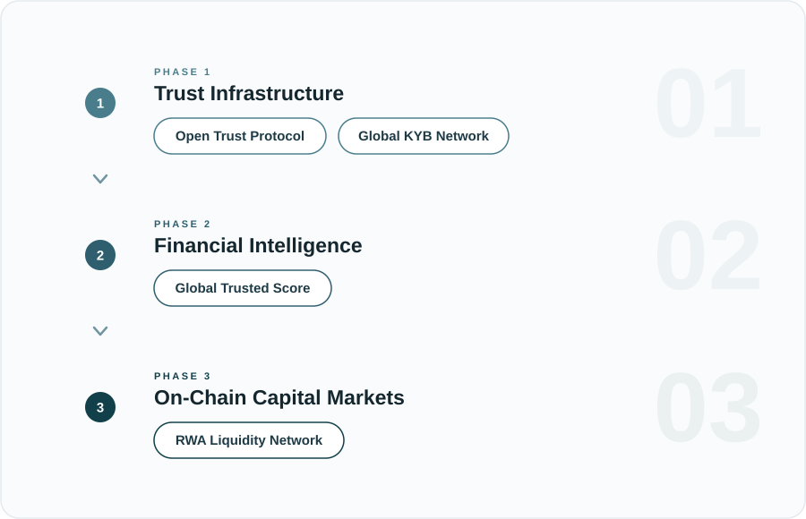
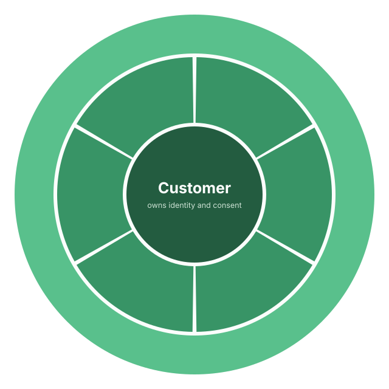

# Onchain Finance

Onchain Finance is a set of community specifications for portable business
identity, reusable compliance, explainable reputation, and permissioned
real-world-asset financing.

This repository contains technical proposals, not deployed software. The
specifications describe a shared trust architecture in which businesses control
their identity and disclosures, providers retain responsibility for their own
decisions, and sensitive information is not exposed as public plaintext.

## Motivation

> When we founded Vero, we believed the hardest part of global payments had
> already been solved. Stablecoins had made cross-border value transfer nearly
> instant, and a growing ecosystem of regulated on-ramp and off-ramp providers
> promised access to local payment rails. Instead, we found an ecosystem where
> every provider independently repeated the same KYB process, requested the
> same documents, managed separate RFIs, and maintained its own isolated view
> of the customer. As we integrated with more providers, it became clear that
> this was not a Vero problem; it was an industry problem.
>
> — Estácio, CTO of Vero

The specifications explore how shared, open trust infrastructure could reduce
that duplication without transferring compliance decisions away from the
institutions responsible for them.

## Ecosystem roadmap

Each phase supplies capabilities used by the next.

## Specification maturity

| Phase | Specification | Maturity | Depends on |
| --- | --- | --- | --- |
| 1 | [Open Trust Protocol](./open-trust-protocol.md) | Community specification | Open identity and credential standards |
| 1 | [Global KYB Network](./global-kyb-network.md) | Community specification | Open Trust Protocol |
| 2 | [Global Trusted Score](./global-trusted-score.md) | Draft community specification | Open Trust Protocol and Global KYB Network |
| 3 | [RWA Liquidity Network](./rwa-liquidity-network.md) | Draft community specification | All preceding specifications |

“Community specification” describes the document’s role in this repository; it
does not mean that an implementation is deployed, audited, certified, or
approved by a standards body or regulator.

## Reading order

1. **[Open Trust Protocol](./open-trust-protocol.md)** defines identity,
   credentials, consent, attestations, encrypted evidence, and verification.
2. **[Global KYB Network](./global-kyb-network.md)** composes those primitives
   into reusable business verification and multi-provider review.
3. **[Global Trusted Score](./global-trusted-score.md)** proposes an explainable
   reputation layer over verified compliance and behavioral events.
4. **[RWA Liquidity Network](./rwa-liquidity-network.md)** proposes how verified
   identities, evidence, and reputation could support permissioned credit
   positions and vaults.

## Design principles

- **Trust before assets:** evaluate the party, claim, evidence, and enforcement
  path behind an asset.
- **Holder-controlled identity:** businesses control their identity data and
  authorize its disclosure; providers verify and rely on it under their own
  policies.
- **Minimum necessary disclosure:** sensitive data remains encrypted and
  permissioned. Public networks carry only the commitments, status, and events
  needed for verification.
- **Legally anchored:** digital positions must map to enforceable rights,
  obligations, permissions, and real-world agreements.
- **Risk controls before scale:** exposure limits, concentration controls,
  collateral or reserve checks, default handling, and reporting precede
  liquidity growth.
- **Open and interoperable:** implementation profiles compose established
  identity, credential, compliance, messaging, token, and verification
  standards where they fit.

## Customer-centered model

The architecture starts with the customer as the source of identity, consent,
commercial activity, reputation, and capital demand. Infrastructure layers
organize around that participant rather than a single provider.

## Example end-to-end financing lifecycle

A financing implementation could follow this pattern:

1. A business creates or connects an organization identity.
2. The business completes KYB and authorizes trusted issuers to verify claims.
3. The business and authorized issuers record encrypted evidence, credentials,
   commitments, and attestations with explicit ownership and access rules.
4. The business grants a provider access to selected claims or proof results.
5. A financial workflow creates a transaction, obligation, collateral record,
   receivable, reserve, or other asset-backed claim.
6. Attestations and lifecycle events update reputation and eligibility.
7. Capital allocators fund eligible positions under explicit risk constraints.
8. Settlement, release, dispute, default, or recovery updates the audit trail
   and any affected score.

## Project boundaries

Putting commitments or status on-chain does not make the underlying data public.

- Sensitive business data may remain in encrypted storage while commitments,
  access policies, and audit references are anchored on-chain.
- The design aims to expose only what a workflow needs to verify permissions,
  status, lifecycle transitions, and risk controls.
- Even when content remains encrypted, public commitments and status events can
  reveal timing or relationship patterns. Implementations must assess and
  minimize metadata correlation.
- Legal claims, collateral rights, identity authority, and compliance decisions
  still depend on enforceable agreements and regulated processes.
- Permissioned assets must reflect holder eligibility, issuer rules,
  jurisdiction-specific restrictions, and revocation procedures.
- Scores must expose their reason codes and evidence basis rather than act as
  opaque approvals.

## Feedback

Public feedback is welcome through GitHub Issues. See
[Contributing](./CONTRIBUTING.md) for the information that makes a
specification report useful.

## References

See [References](./references.md) for the primary standards and market
documentation used across the specifications.

## Disclaimer

These documents are provided for technical discussion. They are not legal,
regulatory, compliance, accounting, financial, or investment advice. Each
implementation and participant remains responsible for its own technical
review, legal analysis, controls, and decisions.

## License

Licensed under the [Apache License, Version 2.0](./LICENSE).
