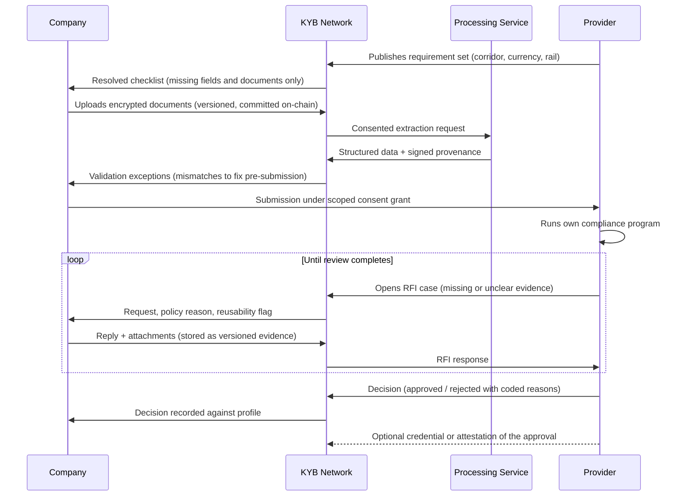
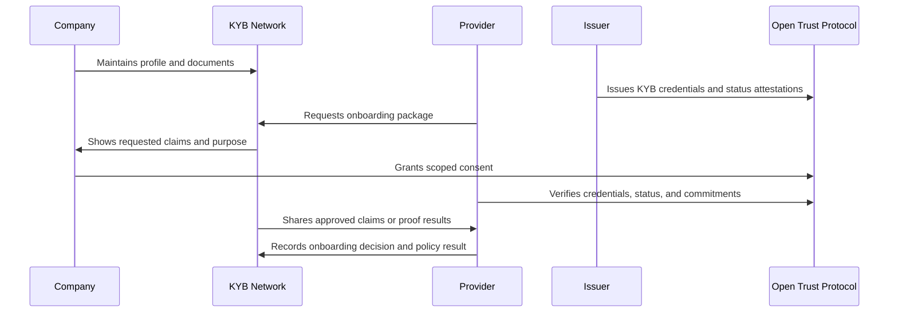
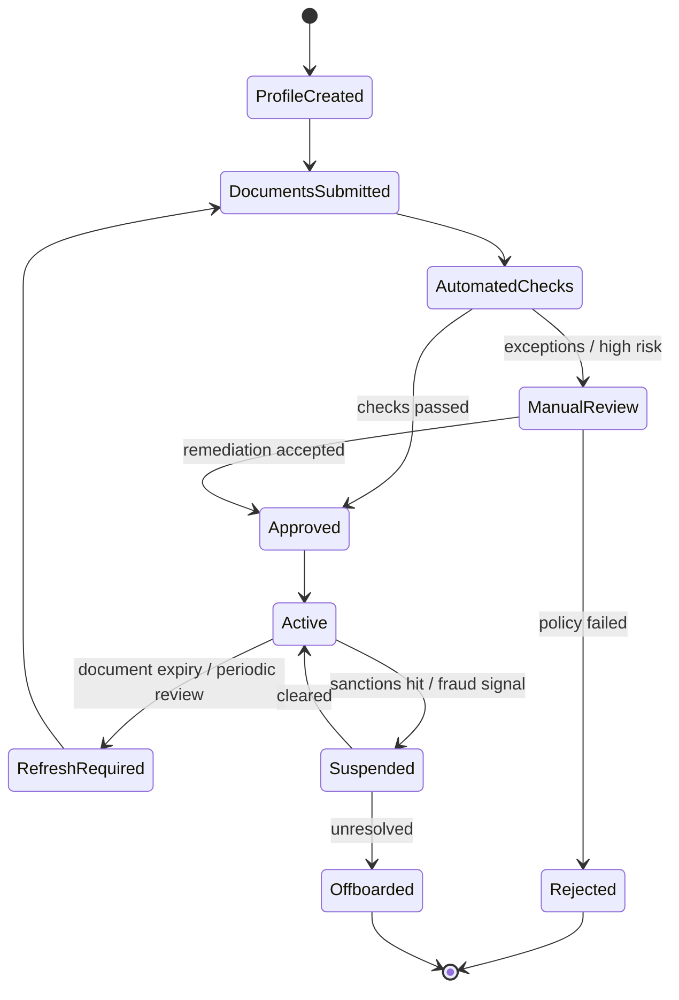
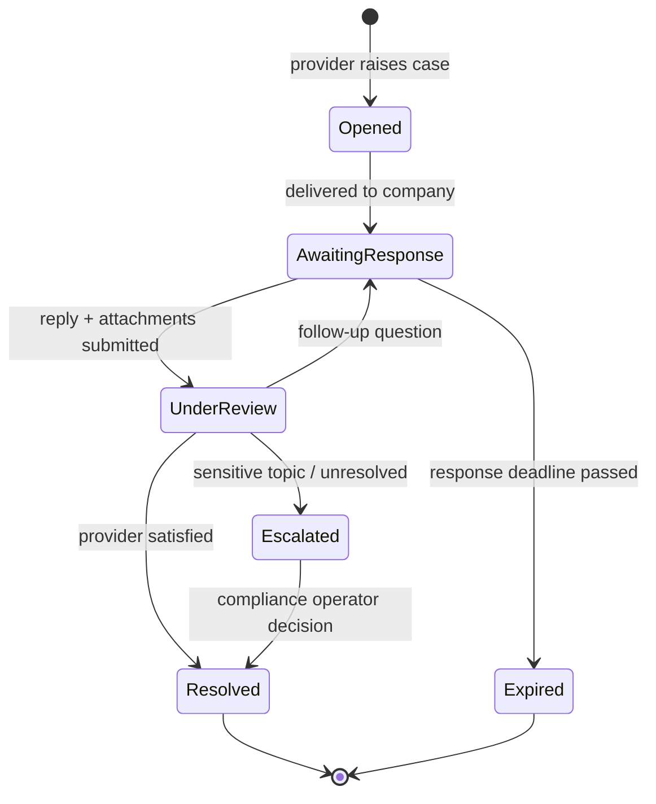

# Global KYB Network

**Reusable business verification on the Open Trust Protocol: one compliance profile, maintained by the company, relied on by every provider it chooses.**

## Abstract

This document specifies the Global KYB Network, a reusable business-compliance network built on the [Open Trust Protocol](./open-trust-protocol.md). A company completes KYB once with an approved verifier, maintains a living compliance profile, and permissions selected facts to financial providers, counterparties, marketplaces, and liquidity networks. Providers publish machine-readable requirement sets; the network resolves them into a single collection checklist and marks what the profile already satisfies. Documents flow through an encrypted pipeline that versions every upload, extracts structured data with signed provenance, and surfaces mismatches before any provider sees the submission. Each provider still applies its own policy and records its own decision, but it relies on structured credentials, document commitments, refresh dates, and trusted issuer attestations instead of asking the company to rebuild the same data room for every relationship. Requests for information are structured cases whose answers become reusable evidence, and approvals can be issued back to the profile as credentials the next provider can rely on. Applications integrate the network once to offer on- and off-ramps and fiat payments directly, while providers onboard and verify the customer by interacting with the customer's identity rather than through the application developer.

The network reduces duplicated onboarding without weakening compliance: it standardizes how requirements, evidence, and decisions are exchanged, while every compliance decision remains with the provider that makes it.

## Motivation

### Businesses repeat onboarding for every provider

To access applications and execute payments, a business onboards with multiple on- and off-ramp providers, and each relationship begins from zero. The same incorporation documents, ownership structure, licenses, and officer identity documents are collected, reviewed, and stored again. Requirements shift with each corridor (target country, fiat currency, stablecoin and network, payment rail, transaction direction), so every new provider produces a new checklist. Providers require original documents; claims about documents do not satisfy their compliance programs. Each provider decides independently, under its own terms of service and its own status progression. Document expiry is tracked separately by each provider, or not at all, and when profile data changes it must be corrected with every provider that approved it. Business verification can take days or weeks and may be slower than individual onboarding, particularly when ownership, licensing, or cross-jurisdiction evidence requires manual review.

### RFIs are answered one by one

Review does not end at submission. Each provider's compliance team comes back with requests for information: an unclear document, a UBO question, a mismatch. The requests arrive through email and support channels, one provider at a time, and the business answers the same question separately for each. The answers leave no reusable record, and neither side keeps a complete audit trail of who requested data, who consented, what was disclosed, and why.

### Application developers stand in the compliance path

To offer on- and off-ramps, an application developer negotiates with payment providers one by one and then mediates their onboarding: collecting customer documents, forwarding them to each provider, and relaying RFI answers in both directions. The developer becomes a compliance intermediary holding sensitive data it does not need, the provider never works directly with the business it is verifying, and every new application rebuilds the same mediation layer.

### What the network changes

The network is designed to reduce repeated collection by letting each party
work from an authorized view of the same maintained profile:

- Payment providers onboard a customer by resolving their requirement set against the customer's existing profile, and they work directly with the customer's identity rather than through an intermediary application developer.
- Applications integrate the network once and offer on- and off-ramps, and fiat payments, directly in the application by interacting with the customer's identity.
- The business maintains baseline KYB evidence and can reuse it when it remains
  authorized, current, accessible, and sufficient for a provider's policy.
  Providers can still request context-specific, updated, or supplemental
  evidence and raise new RFIs.

## Specification

The key words “MUST”, “MUST NOT”, “REQUIRED”, “SHALL”, “SHALL NOT”,
“SHOULD”, “SHOULD NOT”, “RECOMMENDED”, “NOT RECOMMENDED”, “MAY”, and
“OPTIONAL” in this document are to be interpreted as described in BCP 14
[RFC 2119](https://www.rfc-editor.org/rfc/rfc2119)
[RFC 8174](https://www.rfc-editor.org/rfc/rfc8174) when, and only when, they
appear in all capitals, as shown here.

### Relationship to the Open Trust Protocol

The network defines no new trust primitives. It composes the protocol objects of the Open Trust Protocol (`TrustIdentity`, `CredentialClaim`, `ConsentGrant`, `Attestation`, `EncryptedEvidenceRecord`, `RequirementSet`, `ExtractedDataRecord`, `Submission`, and `InformationRequest`) into a multi-provider onboarding workflow: requirement resolution across providers, a shared document pipeline, per-provider submissions and decisions, and structured RFI resolution. Anything the protocol specifies (identity control, credential status, consent semantics, provenance) applies unchanged here and is not restated.

### Participants

| Participant          | Responsibility                                                                                                          |
| -------------------- | ----------------------------------------------------------------------------------------------------------------------- |
| Company              | Owns the profile, submits documents, grants and revokes access.                                                         |
| KYB provider         | Performs identity, ownership, sanctions, adverse-media, and authority checks.                                           |
| Document verifier    | Validates specific evidence such as articles of incorporation, tax documents, financial statements, or trade documents. |
| Processing service   | Extracts structured data from uploaded documents and signs the provenance of every extracted field.                     |
| Application provider | Requests access for onboarding, payments, lending, insurance, or trading workflows.                                     |
| Compliance operator  | Reviews exceptions, high-risk jurisdictions, document mismatches, and escalations.                                      |
| Regulator or auditor | Reviews evidence under legal authority or agreed audit procedures.                                                      |

### Compliance profile

The KYB profile is modular. A provider MUST be able to request only the modules its policy requires, and a submission MUST NOT include modules outside the consent grant's scope.

| Module                | Example fields                                                                              |
| --------------------- | ------------------------------------------------------------------------------------------- |
| Legal entity          | Legal name, registration number, jurisdiction, formation date, entity type.                 |
| Ownership and control | Beneficial owners, directors, authorized signers, ownership thresholds, authority evidence. |
| Risk screening        | Sanctions, PEP, adverse media, high-risk jurisdiction flags, restricted industry flags.     |
| Business operations   | Business description, website, trade lanes, products, counterparties, logistics providers.  |
| Financial evidence    | Bank account validation, statements, tax status, audited financials, revenue bands.         |
| Document status       | Required documents, issuer, validation method, expiry, refresh cadence, commitment root.    |
| Provider decisions    | Approved, rejected, conditional, expired, suspended, manually escalated.                    |

### Requirement discovery

Providers publish machine-readable requirement sets (the `RequirementSet` object of the Open Trust Protocol) instead of PDF checklists. A requirement set is scoped to a context:

- Jurisdiction of the business and of the counterparty.
- Fiat currency and payment rail (local transfer scheme, wire, card).
- Digital asset and network.
- Transaction direction and product (payment, collection, financing, trading).
- Terms of service the business must accept before review begins.

The network resolves the union of requirement sets for the providers a business wants to reach and produces one collection checklist. Fields and documents already present in the profile MUST be marked satisfied; only the difference is collected. A provider whose requirements are a subset of an already-approved review MAY declare that it incorporates the broader check, granting coverage without a second document collection.

### Document pipeline

The pipeline turns collected documents into reusable, provenance-tracked profile data. Every stage MUST produce versioned records; nothing overwrites history.

1. **Collect.** The business gathers documents against the resolved checklist: formation documents, ownership and control evidence, licenses, proof of address, officer identity documents with issuing country and validity dates.
2. **Upload.** Documents encrypt client-side into the company's data room. A commitment (hash, document type, version, expiry) anchors on-chain. The company holds the keys; the network stores ciphertext.
3. **Extract.** A consented processing service parses each document into structured fields: legal name, registration number, formation date, registered address, shareholder allocations, signatory names. The service MUST sign its output, so every profile field records whether it is self-declared, extracted from a named document, or verified by an issuer.
4. **Validate.** Extracted data cross-checks against self-declared data and against other documents. Mismatches (a name spelling, an outdated address, an ownership percentage that does not sum) surface as exceptions before any provider sees the submission, when they are cheapest to fix.
5. **Submit.** The business grants each provider a scoped consent and delivers a `Submission`: the claims, structured data, and source documents that provider's requirement set demands, and nothing more.
6. **Maintain.** Expiry dates drive refresh workflows before credentials go stale. When data changes, the network resynchronizes affected submissions to each relying provider, and each provider decides whether the change triggers re-review.

### Submission and review flow

The document path, including the RFI loop, runs alongside the credential path. This is the flow that MUST work on day one, before any credential reuse exists.

### Credential exchange flow

Once issuers exist, the credential path lets a provider verify claims without a fresh document collection:

### KYB lifecycle

### Information requests

RFIs are not an exception path; they are a routine part of every compliance review. Today they arrive through email and support channels, are answered separately for each provider, and leave no reusable record. The network makes them structured objects (the `InformationRequest` object of the Open Trust Protocol).

An RFI case carries a subject, the provider that raised it, the submission it concerns, a threaded message history with attachments, a triage classification, and a resolution state:

Rules that keep RFIs bounded and useful:

- Every case MUST tie to a specific missing claim, stale document, mismatch, or policy exception, with the policy reason stated.
- The company MUST see which provider raised the case and whether the answer will be reusable for future submissions.
- Responses and attachments enter the profile as versioned evidence, not as one-off email replies; an answer given once is available the next time any provider asks the same question.
- Automated request generation MUST be reviewed for sensitive cases such as sanctions, fraud, politically exposed persons, or high-risk jurisdictions.
- Each case MUST carry a provider-defined response-time expectation, and its audit trail MUST record the full exchange.

### Provider decisions

Each provider's review concludes with a recorded decision, never a bare status flag:

| State                  | Meaning                                                                                                                            |
| ---------------------- | ---------------------------------------------------------------------------------------------------------------------------------- |
| Draft                  | Submission assembled but not yet delivered.                                                                                        |
| Under review           | Provider compliance program running; RFI cases may open.                                                                           |
| Approved               | Coverage granted for the requirement set's scope.                                                                                  |
| Conditionally approved | Approved with obligations: pending document, transaction limits, enhanced monitoring.                                              |
| Rejected               | Failed with structured reason codes (for example, an expired document or unverifiable owner) plus the provider's original message. |
| Suspended              | Previously approved; paused on a sanctions hit, fraud signal, or expired evidence.                                                 |
| Expired                | Approval lapsed after the provider's recency threshold.                                                                            |

Decisions emit events the company and its applications subscribe to, replacing polling. Approved decisions MAY be issued back to the profile as credentials or attestations. This is the mechanism that turns one provider's completed review into evidence the next provider can rely on, and the input the [Global Trusted Score](./global-trusted-score.md) builds on.

### Provider policies

Providers need their own onboarding policies even when they rely on shared credentials. A policy MAY define:

- Required credential types and accepted issuers.
- Recency thresholds for sanctions, ownership, and document checks.
- Jurisdiction, industry, exposure, and transaction-size restrictions.
- Enhanced due-diligence triggers.
- Required officer authority for high-value payment or financing actions.
- Manual review rules for unresolved mismatches.

## Rationale

### Why the network keeps today's flow

Providers will not abandon dynamic requirements, raw document review, or independent decisions, and a network that asked them to would fail at adoption. The design therefore reproduces the flow providers already run (requirement resolution, document uploads, per-provider decisions, clarification through structured RFIs) and changes only where the artifacts live and who owns them.

### Why documents and RFIs come before credential reuse

Credential reuse requires an issuer network that does not exist yet, and regulated providers will keep requiring source documents regardless. The submission and review flow, including structured RFIs, is therefore the day-one product: it must work with zero credentials in circulation. Credential reuse then grows out of it: each approved decision issued back as a credential increases what the next provider can rely on without lowering what any provider can demand.

### Why RFIs are structured objects

RFIs consume a large share of review time and are the least captured part of today's flow. Making them protocol objects changes this: the company answers each question once and reuses the answer, the provider gets an auditable record of what was asked and delivered, and triage classification routes sensitive cases to human review while routine ones resolve quickly. An RFI model that lived in email could offer none of this.

### Why decisions are issued back as credentials

A provider's approval is the most expensive artifact in the system: it represents a completed compliance review. Recording it only in the provider's database wastes that cost for everyone else. Issuing it back to the profile as a credential converts the review into portable evidence: the next provider's subset check, a lender's eligibility check, and the Global Trusted Score all build on decisions that would otherwise be locked away.

### Adoption path

The network deploys in stages, each usable on its own:

1. Define the minimum reusable KYB profile for companies, institutional investors, issuers, and service providers.
2. Implement the document pipeline: encrypted upload, versioning, extraction with signed provenance, and pre-submission validation.
3. Implement provider requirement sets and scoped submissions matching the flows providers run today.
4. Implement structured RFI cases with threaded responses stored as reusable evidence.
5. Define credential schemas for entity identity, ownership/control, sanctions status, authorized signers, and provider approval.
6. Add consent grants for provider-specific access.
7. Add document expiry, refresh, and resynchronization workflows.
8. Add provider policy evaluation and exception queues.
9. Issue provider decisions back as reusable credentials and attestations.
10. Add selective disclosure and proof-only policies after baseline adoption.

## Backward Compatibility

- **Existing onboarding flows.** The requirement-resolution, document-upload, per-provider-decision, and RFI flows that providers run today map directly onto the network's objects. A business or provider migrating in keeps its process; only the storage and ownership of the artifacts change.
- **Provider compliance programs.** Providers keep their own policies, their own review procedures, and full responsibility for their own decisions. Nothing in the network approves anyone; it supplies verified inputs.
- **Non-participating providers.** A company can still export documents and answers collected in its profile for a provider outside the network; participation upgrades the exchange but is not required for the company to benefit from maintaining one profile.

## Security Considerations

- **Systemic reliance on weak issuers.** A shared profile concentrates trust: if issuer governance is poor, one weak issuer's credentials propagate to every relying provider. Issuer admission, monitoring, and removal follow the Open Trust Protocol's policy authority, and providers SHOULD restrict accepted issuers in their policies.
- **Source-document access.** Providers may need direct access to some source documents for regulated workflows. Consent scopes must support document-level grants without opening the whole data room.
- **Data residency and privacy.** Data residency and privacy laws may restrict where profile data can be stored and processed. Encrypted storage location and processing-service jurisdiction are deployment decisions that MUST respect the strictest applicable regime for the data in scope.
- **Automated RFIs on sensitive topics.** Automatically generated requests touching sanctions, fraud, PEP status, or high-risk jurisdictions can tip off a subject or mishandle a legal obligation; they MUST pass human review before delivery.
- **Stale evidence.** A resynchronization or refresh failure leaves providers relying on outdated submissions. Expiry MUST be visible to relying providers, and providers SHOULD apply recency thresholds rather than trusting a submission indefinitely.

## References

### Standards

- [W3C Verifiable Credentials Data Model v2.0](https://www.w3.org/TR/vc-data-model-2.0/)
- [W3C Decentralized Identifiers (DIDs) v1.0](https://www.w3.org/TR/did-core/)
- [About ISO 20022](https://www.iso20022.org/about-iso-20022)
- [SEP-12: KYC API](https://github.com/stellar/stellar-protocol/blob/master/ecosystem/sep-0012.md)

### Regulatory

- [FATF Guidance for a Risk-Based Approach to Virtual Assets and VASPs](https://www.fatf-gafi.org/en/publications/Fatfrecommendations/Guidance-rba-virtual-assets-2021.html)
- [FATF 2025 Targeted Update on Implementation of the Standards on Virtual Assets/VASPs](https://www.fatf-gafi.org/en/publications/Fatfrecommendations/targeted-update-virtual-assets-vasps-2025.html)
