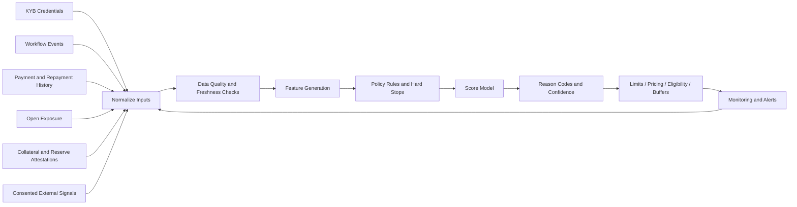
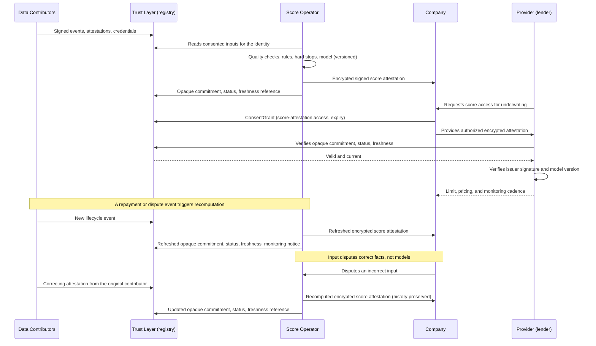
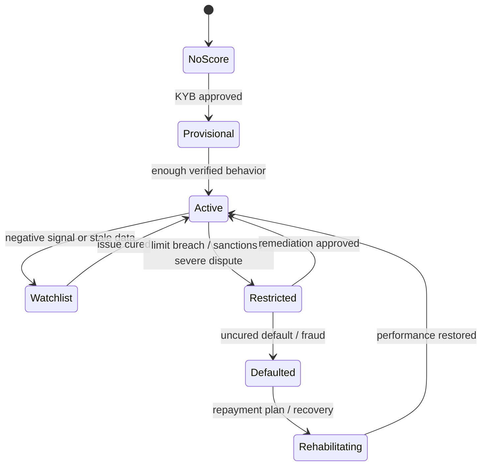

# Global Trusted Score

> **Draft community specification.** This document is conceptual, has no
> production implementation in this repository, and may change without notice.

**Portable reputation for global businesses.**

The **Global Trusted Score** is a privacy-preserving reputation and risk layer for companies. It converts verified identity, compliance status, trade behavior, repayment performance, open exposure, document quality, and trusted third-party attestations into score bands that providers can use for onboarding, credit limits, pricing, collateral buffers, and monitoring.

The score should never be a naked number detached from evidence. Each score output needs reason codes, data freshness, source categories, and policy constraints so a lender, vault manager, or counterparty can understand the risk basis.

## Goals

- Create portable business reputation that follows a company across financial providers.
- Improve underwriting with verified behavior instead of only static statements.
- Allow providers to evaluate eligibility while preserving confidentiality.
- Convert workflow history into dynamic limits and pricing.
- Penalize delays, unresolved disputes, defaults, fraud signals, stale KYB, and excessive exposure.
- Reward verified repayment, clean settlement, strong documentation, collateral buffers, and long-term counterparty performance.

## Business credit data today

Credit infrastructure exists for consumers and large corporations, but its
coverage and portability for smaller businesses vary by jurisdiction, provider,
and company size. Cross-border use depends on whether a receiving institution
accepts the available records.

Credit bureaus often operate within national or regional frameworks. A payment
history built in Brazil may not be accepted by a lender in Mexico, and an
exporter with a long history of clean settlement can face difficulty presenting
it to a provider that was not a counterparty to those transactions. Where bureau
coverage exists, it may be built from data reported *about* the business by
institutions, on their schedule and in their format, with varying opportunities
for the business to inspect or correct the record.

As a result, providers may request fresh financial statements, bank records, and
references when existing history is unavailable or cannot be reused. This can
increase uncertainty and duplicate diligence, especially for small and mid-size
companies operating across borders or outside the coverage of a single bureau.

A second pattern illustrates the value of verified behavior. Payment platforms
can use transaction flows they observe when lending to their own merchants;
those data can remain siloed within the platform and unavailable to other
providers. The merchant may therefore be unable to reuse that history elsewhere
without a compatible disclosure arrangement.

The Global Trusted Score applies the platform-lending insight (underwrite from
observed behavior) to protocol-associated activity. With holder authorization,
that activity can be disclosed through the [Open Trust Protocol](./open-trust-protocol.md)
and the [Global KYB Network](./global-kyb-network.md) in a form a provider can
evaluate, subject to its own policies and applicable requirements.

## How the system works

The proposed score is a computation layer over data produced by the earlier
phases rather than a new collection channel. Three properties distinguish the
design from a traditional bureau.

**Inputs are verified before they are scored.** Under the proposed model, each
input arrives as a protocol object with provenance: a credential from an
approved issuer, an attestation signed by a known attestor, a lifecycle event
committed by a financial workflow, or an exposure readable on-chain.
Self-reported data can participate, but it is labeled as such and weighted
accordingly. The provenance ladder defined by the trust protocol
(self-declared, document-backed, extraction-signed, issuer-verified) carries
directly into feature weighting.

**Computation is reproducible and explainable.** The proposed scoring process is
rules-first: deterministic policy rules and hard stops run before any
statistical model, and every output binds to a model version and a commitment to
the exact input snapshot used. Reconstruction requires authorized access to the
retained exact input snapshot, the immutable or versioned model, rules, feature
definitions, and relevant execution configuration. The snapshot is verified
against its commitment before reproduction, so a commitment does not itself
retrieve the underlying data. Reason codes are part of the output object rather
than an optional report.

**Outputs are attestations, not transient API responses.** A conforming score
result is a signed attestation with a score band, product eligibility, reason
codes, input-snapshot commitment, model version, computation date, and freshness
window. Its payload remains encrypted, off-chain, and holder-controlled; only an
opaque commitment plus a status and freshness reference is publicly anchored,
unless a separate intentional public disclosure is authorized. Consent gates
payload access. Providers verify the attestation as they verify another
credential—issuer signature, status, and expiry—and a stale score fails
verification against its freshness window rather than silently misleading a
relying provider.

Score updates are event-driven. A repayment, a resolved dispute, a new default, or an expired KYB credential triggers recomputation for the affected identity, and monitoring events notify relying providers that a fresh attestation exists, without disclosing its content until they hold consent.

## Participants

| Participant | Responsibility |
| --- | --- |
| Scored company | Owns the identity profile and builds reputation through verified activity. |
| Data contributor | Provides verified events, credentials, payment facts, collateral attestations, or financial signals. |
| Score operator | Maintains model versions, feature definitions, reason codes, monitoring, and governance. |
| Provider | Uses score outputs for onboarding, limits, pricing, collateral, and review cadence. |
| Compliance reviewer | Handles hard-stop rules, exception review, disputes, corrections, and adverse-action requirements. |
| Auditor | Reviews model governance, input provenance, explainability, and historic decision reconstruction. |

## Score inputs

| Category | Examples | Trust requirement |
| --- | --- | --- |
| Identity quality | KYB status, issuer quality, ownership clarity, authorized signers. | Credential from approved issuer. |
| Compliance risk | Sanctions status, jurisdiction, restricted industry, adverse-media review. | Current screening attestation. |
| Trade behavior | Deal completion, escrow acceptance, delivery timing, dispute rate. | Event commitments from financial workflow. |
| Credit behavior | Repayment timing, defaults, restructurings, prepayments, cure history. | Position lifecycle events and payment attestations. |
| Exposure | Active receivables, debt, collateral, vault concentration, counterparty exposure. | On-chain positions plus encrypted facility records. |
| Financial capacity | Revenue band, cash balance band, audited statements, bank validation. | Selective disclosure or proof from trusted provider. |
| Collateral quality | Title control, goods control, insurance, reserve coverage, liquidation path. | Attestation by custodian, logistics provider, auditor, or originator. |

## Score outputs

| Output | Used by |
| --- | --- |
| Score band | Counterparty acceptance, onboarding priority, monitoring intensity. |
| Product eligibility | Escrow, BNPL, receivable financing, collateral-backed import finance, vault participation. |
| Credit limit | Maximum exposure by company, counterparty, tenor, jurisdiction, and product. |
| Pricing band | APR, discount rate, fee tier, advance rate, required spread. |
| Buffer requirement | First-loss buffer, yield prepay, collateral margin, reserve threshold. |
| Review cadence | Periodic refresh interval and enhanced-due-diligence triggers. |
| Reason codes | Human-readable explanation for approval, decline, downgrade, or monitoring alert. |

## Scoring pipeline

## Illustrative user journey

This non-normative example considers an exporter using the
[Open Trust Protocol](./open-trust-protocol.md): KYB is complete, two payment
providers are onboarded, and operating history is accumulating.

**1. A provisional score exists from day one.** The moment KYB completes, the company holds a provisional score derived from identity quality alone: approved issuer, clear ownership, clean sanctions screening, jurisdiction. It is honest about its own thinness: the reason codes state that behavioral history is absent. Even so, it is more than a new provider knows about a walk-in applicant today.

**2. Behavior accrues without any extra work.** Every settlement through the company's payment providers commits lifecycle events; logistics partners attest shipments; an early receivables facility records clean repayment. None of this requires the company to report anything; the events are byproducts of workflows already running on the trust layer. Within months the score graduates from provisional to active, and the reason codes shift from "insufficient history" to specific verified strengths.

**3. A new lender reuses existing evidence.** When the company applies for
working capital, it grants the lender consent to the score attestation (band,
eligibility, reason codes, freshness) rather than to all underlying
transactions. This can reduce repeated diligence; it does not guarantee an
approval time. The lender verifies the attestation’s issuer, model version, and
snapshot commitment, applies its own policy to the band, and prices the
facility. If its policy needs more evidence, it can request a narrower
disclosure, such as a revenue-band proof, instead of a full data room.

**4. A negative event is handled proportionately.** A commercial dispute with an importer delays one repayment. The event moves the company to a watchlist band and the reason codes say exactly why: one active dispute, all other signals performing. The dispute resolves, a cure event is recorded, and the score recovers on the next computation. The company can see the same reason codes its lenders see; nothing about the downgrade is opaque.

**5. An error is correctable.** A servicer misreports a payment as late. The company disputes the input, the servicer issues a correcting attestation, and the score recomputes from a corrected snapshot, with both the error and the correction preserved in the audit trail. The dispute process operates on inputs, which are facts, rather than on the model, which is policy.

## Sequence: from verified events to a lending decision

## Requirements

| Requirement | Why it matters | Where it comes from |
| --- | --- | --- |
| Verified event streams | A score over self-reported data is a questionnaire, not a reputation. | Lifecycle events and attestations from Phase 1 workflows. |
| Input provenance labeling | Providers must know whether a feature rests on issuer-verified or self-declared data. | The trust protocol's provenance ladder. |
| Normalized event schemas | Cross-provider events must mean the same thing before they can be compared. | Shared attestation topics and schema governance. |
| Snapshot reproducibility | Historic decisions must be reconstructible for audits, disputes, and adverse-action review. | Authorized retained snapshots, immutable or versioned models, rules, feature definitions, execution configuration, and snapshot commitments. |
| Consent-gated output | The company decides which provider sees its score; scoring must not become surveillance. | Consent grants from the trust protocol. |
| Contributor accountability | Bad inputs must trace to a signer who can be required to correct them. | Attestor registry and signed contributions. |
| Input dispute process | Errors must be correctable without letting subjects negotiate their own scores. | Correcting attestations with preserved history. |
| Jurisdictional review | Automated decisioning and adverse-action rules differ by market. | Legal review per jurisdiction before provider adoption. |

## Lifecycle

## Implementation roadmap

1. Define score inputs from KYB status, transaction events, payment history, receivable performance, debt repayment, collateral control, reserve coverage, and open exposure.
2. Define hard-stop policy rules for sanctions, expired KYB, unauthorized signer changes, unresolved defaults, and restricted jurisdictions.
3. Build an explainable rules-first score band before introducing statistical or machine-learning models.
4. Map score bands to product limits, pricing, advance rates, collateral buffers, and vault eligibility.
5. Add monitoring events for downgrade, watchlist, review-required, default, cure, and rehabilitation.
6. Add model versioning, reason-code storage, and evidence snapshots for audit and dispute review.
7. Expand supported products only after event schemas and score governance are stable.

## Governance requirements

- Score changes should be reproducible from versioned input snapshots.
- Hard-stop compliance rules should override model outputs.
- Providers should see reason codes and missing-data explanations.
- Model versions should be logged so historic approvals can be reconstructed.
- Protected or sensitive attributes should be excluded unless legally required and explicitly governed.
- Adverse action or decline workflows need jurisdiction-specific legal review.

## Privacy model

The scoring layer should prefer structured facts, encrypted records, bands, and proofs over uncontrolled document sharing. Examples:

- "KYB approved by approved issuer" instead of full KYB packet.
- "Revenue band: 10-25M USD" instead of bank statements.
- "No uncured default in last 24 months" instead of full credit history.
- "Collateral coverage above required threshold" instead of full custodian report.

Where providers need full documents, access should flow through consent grants, encrypted access, and audit logs rather than uncontrolled file exports.

## Risks and open questions

- Early data can be sparse, making provisional scores fragile.
- Scores can create procyclical credit tightening if negative events are over-weighted.
- Cross-provider event quality must be normalized before comparison.
- Some jurisdictions may restrict automated decisioning or require specific explanations.
- Fraud rings can attempt to manufacture good behavior through synthetic counterparties.
- Dispute events need careful labeling so valid commercial disputes do not look like defaults.

## References

- [Open Trust Protocol](./open-trust-protocol.md): source of identity, consent, attestation, and provenance primitives.
- [Global KYB Network](./global-kyb-network.md): source of compliance status and provider decisions.
- [W3C Verifiable Credentials Data Model v2.0](https://www.w3.org/TR/vc-data-model-2.0/)
- [W3C Decentralized Identifiers (DIDs) v1.0](https://www.w3.org/TR/did-core/)
- [Ethereum Attestation Service](https://attest.org/): reference pattern for attestations and opaque commitments used with score inputs and outputs.
- [FATF 2021 Guidance for a Risk-Based Approach to Virtual Assets and VASPs](https://www.fatf-gafi.org/en/publications/Fatfrecommendations/Guidance-rba-virtual-assets-2021.html): 2021 guidance; see the 2025 targeted update below for later implementation context.
- [FATF 2025 Targeted Update on Implementation of the Standards on Virtual Assets/VASPs](https://www.fatf-gafi.org/en/publications/Fatfrecommendations/targeted-update-virtual-assets-vasps-2025.html)
- [About ISO 20022](https://www.iso20022.org/about-iso-20022)
