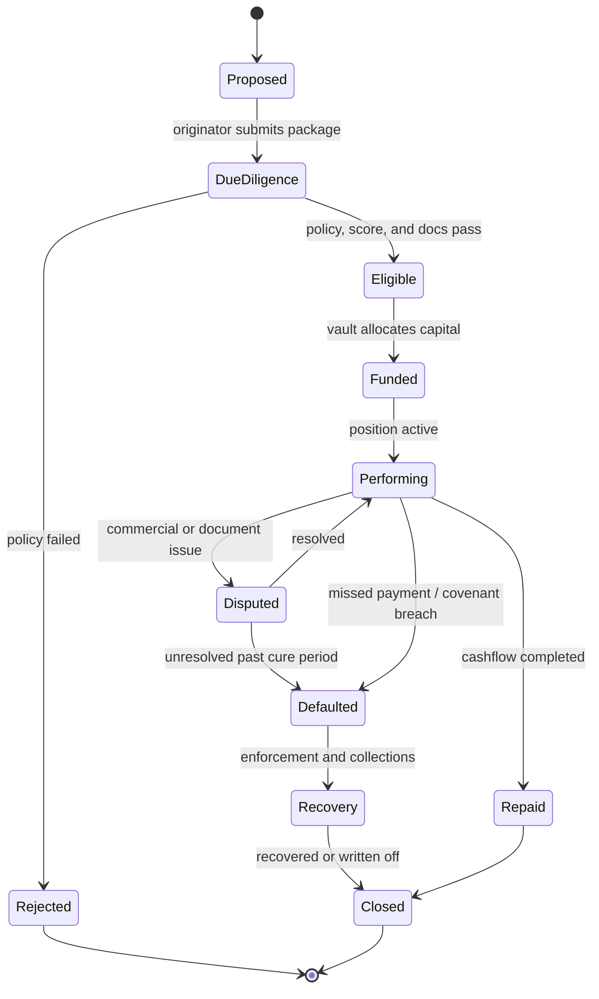
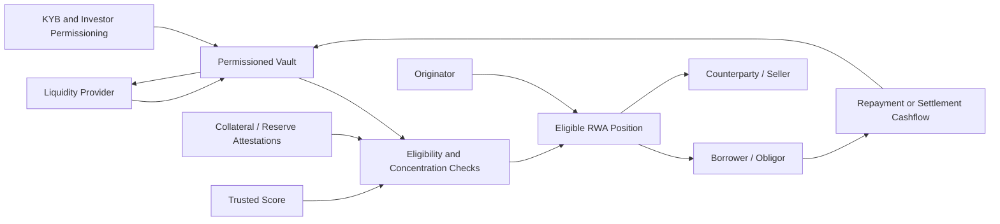
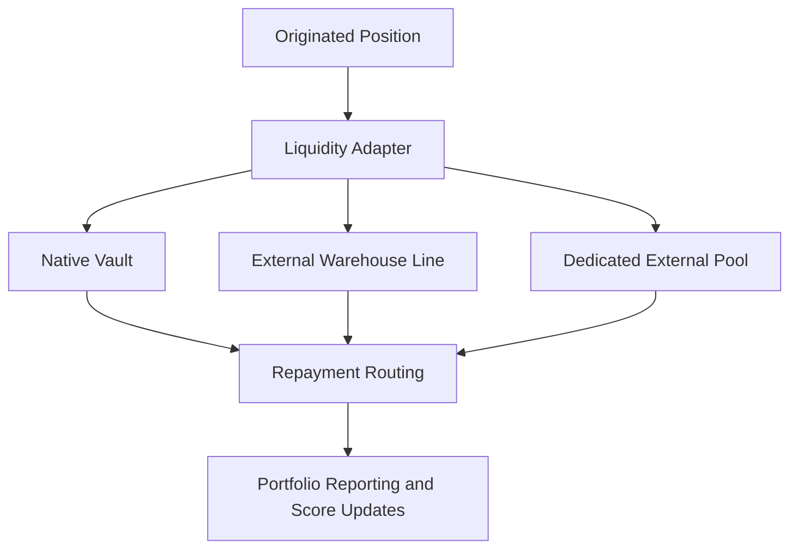
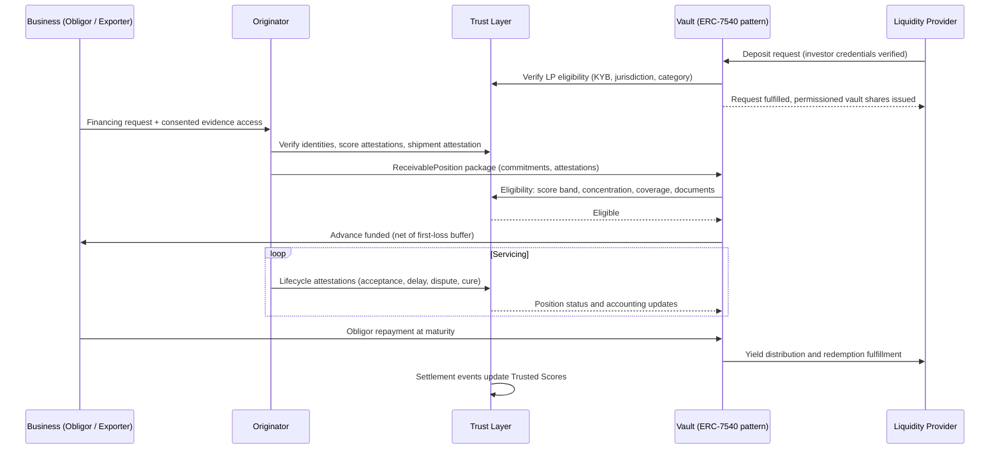

# RWA Liquidity Network

> **Draft community specification.** This document is conceptual, has no
> production implementation in this repository, and may change without notice.
> **Legal and regulatory scope.** This conceptual specification is not legal,
> regulatory, compliance, accounting, financial, or investment advice.
> Standards, credentials, and transfer controls do not determine legal
> classification, regulatory compliance or approval, or suitability. Deployments
> require jurisdiction-specific agreements, controls, and professional review.

**Verified real-world credit exposure funded by compliant on-chain capital: positions whose underwriting inputs are verifiable at origination and whose lifecycle events build portable reputation.**

## Abstract

This document specifies the RWA Liquidity Network, a credit network built on the [Open Trust Protocol](./open-trust-protocol.md), the [Global KYB Network](./global-kyb-network.md), and the [Global Trusted Score](./global-trusted-score.md). The network connects real-world financial exposures (trade receivables, payment obligations, escrow-backed settlement funds, reserve-backed assets, collateral-backed credit positions) to on-chain vaults whose holders are permissioned through trust-layer credentials. Legal enforceability stays with real-world agreements. Public chains carry only the minimum necessary commitments, status references, and pseudonymous identifiers; sensitive ownership, eligibility, position, lifecycle, allocation, repayment, and reporting details remain encrypted or access-controlled and consent-gated. An originator packages an exposure from evidence the trust layer already maintains, a vault evaluates it against a policy fixed before capital was accepted, servicing events arrive as signed attestations that update both investor reporting and the obligor's Trusted Score, and exception paths (disputes, defaults, recoveries) follow procedures defined in advance.

The network builds on existing vault and token standards rather than defining
new transfer or accounting interfaces. Requirements are expressed as properties
such as permissioned holding, asynchronous liquidity, attested collateral, and
defined loss allocation. ERC-4626, ERC-7540, ERC-3643, SEP-8, and CAP-35 are
candidate implementations within network profiles. The proposed network
connects those mechanics to the trust layers: token standards govern how
positions are held and transferred, while trust-layer policies govern who may
hold them and which evidence supports eligibility.

## Motivation

### Tokenization works; trust in the underlying does not scale

Production protocols such as [Centrifuge](https://docs.centrifuge.io/) and
[Maple](https://docs.maple.finance/) demonstrate tokenized treasury,
private-credit, and asset-backed lending workflows. Their existence shows that
token and vault mechanics can support real financial products; it does not make
the off-chain evidence or diligence behind positions portable across platforms.

Trust in the off-chain reality behind each position remains a recurring design
challenge: Is the obligor who it claims to be? Is the invoice real, or already
financed elsewhere? Is the collateral controlled, insured, and unencumbered? Is
the servicer's reporting true? Platforms may answer those questions through
their own legal review, document collection, and originator relationships.
Evidence and performance history may therefore require renewed review when they
are not portable or accepted across platforms.

### Diligence economics can constrain access

When diligence is costly and relationship-specific, it is easier to amortize
over larger positions. Smaller and mid-size businesses, particularly those
operating across jurisdictions, can face proportionally higher onboarding and
underwriting costs even when they have receivables or trade flows that could
support financing.

### What the network changes

The proposed network aims to reduce those costs as the third phase of the
ecosystem. The Open Trust Protocol supplies verified identities, attested
documents, and consented evidence for participants in a position: obligor,
originator, servicer, and custodian. The Global KYB Network supplies reusable
compliance evidence and decisions, subject to each provider's policy. The
Global Trusted Score proposes portable behavioral history. The network composes
these into positions whose underwriting inputs can be verified at origination
and whose lifecycle events can inform later reputation and diligence.

## Specification

The key words “MUST”, “MUST NOT”, “REQUIRED”, “SHALL”, “SHALL NOT”,
“SHOULD”, “SHOULD NOT”, “RECOMMENDED”, “NOT RECOMMENDED”, “MAY”, and
“OPTIONAL” in this document are to be interpreted as described in BCP 14
[RFC 2119](https://www.rfc-editor.org/rfc/rfc2119)
[RFC 8174](https://www.rfc-editor.org/rfc/rfc8174) when, and only when, they
appear in all capitals, as shown here.

### Relationship to the trust layers

The network defines no new trust primitives. Every party in a position resolves to a `TrustIdentity` of the Open Trust Protocol; eligibility reads `CredentialClaim`, `Attestation`, and score attestations; evidence lives as `EncryptedEvidenceRecord` objects with on-chain commitments; disclosure runs through `ConsentGrant` objects. Compliance status for obligors, originators, and investors comes from the Global KYB Network; behavioral history comes from the Global Trusted Score. Anything those layers specify (identity control, credential status, consent semantics, provenance) applies unchanged here and is not restated. What the network adds are position, vault, and lifecycle objects and the rules connecting them to capital.

### Reliance on existing standards

The network composes existing asset and vault standards and does not bind every
deployment to a single implementation. Normative requirements are expressed as
properties, while concrete standards are named as recommended implementations
within a network profile. Two initial profiles illustrate the pattern.

On Ethereum networks:

- [**ERC-4626**](https://eips.ethereum.org/EIPS/eip-4626) is the RECOMMENDED tokenized vault interface for vault share/asset conversion and entry/exit interfaces. This lets allocators, integrators, and reporting tools use the standard interface without a custom vault interface.
- [**ERC-7540**](https://eips.ethereum.org/EIPS/eip-7540) is the RECOMMENDED extension for asynchronous deposits and redemptions. Real-world positions settle on real-world timelines (wire confirmations, receivable maturities, SPV approvals), and the request/fulfill pattern represents that honestly.
- [**ERC-3643**](https://eips.ethereum.org/EIPS/eip-3643) demonstrates the RECOMMENDED transfer-control pattern: identity-registry-gated transfers under which ineligible wallets cannot hold regulated positions. The network keeps this control with eligibility resolved against trust-protocol credentials rather than a platform-specific registry.
- Collateral confirmations, reserve coverage, and servicing events follow the on-chain attestation pattern; independent reserve verification MAY use feeds such as [Chainlink Proof of Reserve](https://chain.link/proof-of-reserve) where a data-provider network adds assurance.

On Stellar:

- [**SEP-8**](https://github.com/stellar/stellar-protocol/blob/master/ecosystem/sep-0008.md) regulated assets give issuers per-transaction approval: an approval server authorizes each transfer, providing transaction-level compliance control where positions are issued as Stellar assets.
- [**CAP-35**](https://github.com/stellar/stellar-protocol/blob/master/core/cap-0035.md)
  asset clawback supports issuer-controlled recovery flows for fraud, error,
  lost institutional wallets, or court-ordered actions, subject to applicable
  law and the asset’s governing agreements.
- A Stellar profile MAY use [**Soroban smart contracts**](https://developers.stellar.org/docs/build/smart-contracts/overview) for vault, eligibility, and lifecycle logic; authorization policy remains a profile/deployment choice.

Other profiles MAY be defined without changing the network's objects. The division of labor is deliberate: token and vault standards handle the mechanics of holding and transferring positions, and the trust layers decide who qualifies to hold them and whether the exposure behind them deserves funding. Existing RWA standards address vault share/asset conversion, entry/exit, and transfer mechanics; trust-layer policies address participant eligibility and the evidence behind an exposure.

### Participants

| Participant                   | Responsibility                                                                      |
| ----------------------------- | ----------------------------------------------------------------------------------- |
| Originator                    | Sources and underwrites eligible real-world assets or credit exposures.             |
| Issuer or SPV                 | Holds or administers legal claims and issues on-chain positions or vault interests. |
| Servicer                      | Tracks payments, collections, defaults, disputes, recoveries, and reporting.        |
| Custodian or collateral agent | Confirms reserve assets, goods control, title documents, or secured collateral.     |
| Vault manager                 | Defines strategy, eligibility, concentration, liquidity, and risk limits.           |
| Liquidity provider            | Supplies USD-stable capital to vaults or external credit facilities.                |
| Auditor                       | Reviews issuer controls, portfolio data, reserves, and legal documentation.         |

### Position types

| Position             | Example exposure                                                       | Primary risk                                             |
| -------------------- | ---------------------------------------------------------------------- | -------------------------------------------------------- |
| `EscrowPosition`     | Locked settlement funds for a trade deal.                              | Release dispute, fraud, operational error.               |
| `ReceivablePosition` | Exporter receivable assigned to a vault.                               | Importer non-payment, document mismatch, dilution.       |
| `DebtPosition`       | Importer BNPL obligation funded by a vault or SPV.                     | Borrower default, late payment, enforcement delay.       |
| `CollateralPosition` | Transport title, goods, buffer, or insurance linked to import finance. | Perfection failure, custody failure, valuation gap.      |
| `VaultShare`         | LP claim on a pool of eligible positions.                              | Portfolio credit risk, liquidity mismatch, manager risk. |

New position types SHOULD be admitted only after their legal templates, evidence checklists, and default procedures are defined, and new originators only after issuer governance, reporting, and default handling are proven.

### Position lifecycle

A position moves through six stages. Each stage consumes objects the earlier phases already maintain and produces events the ecosystem reads back.

1. **Origination.** An originator packages an exposure: obligor identity reference, receivable or obligation data, encrypted evidence (invoices, contracts, transport documents) with on-chain commitments, and the attestations the asset class requires. Every party in the package MUST resolve to a verified `TrustIdentity` with current KYB status.
2. **Eligibility.** The vault's policy engine evaluates the package against the vault definition: credential and issuer requirements, minimum score band, concentration limits, collateral coverage, jurisdiction rules. The verifier MUST NOT require resubmission solely because evidence is stored elsewhere when it remains authorized, current, accessible, and sufficient under the verifier’s policy. It MAY request updated or supplemental evidence where law, policy, provenance, freshness, or independent diligence requires.
3. **Funding.** An eligible position receives allocation from a vault under its advance-rate and buffer rules. LP deposits and redemptions follow the asynchronous request/fulfill pattern, matching cash movement to real settlement.
4. **Servicing.** The servicer records lifecycle events as signed attestations: invoice acceptance, shipment confirmation, payment received, delay, dispute, cure. Events update position status, vault accounting, and, through the score, the obligor's and originator's portable reputation.
5. **Settlement.** Repayment routes to the vault; yield distributes to LPs; redemption requests fulfill. Escrow-backed and reserve-backed structures release against attested conditions.
6. **Exception handling.** Disputes, defaults, recoveries, and write-offs follow the procedures fixed in the vault definition, each recorded as events. Stale servicer reporting or failed reserve checks MUST trip circuit breakers that pause new funding automatically.

The loop closes at stage four: the same events that keep LPs informed are the behavioral inputs that update the Trusted Score. Performing in this market means more than repaying on time: each verified event adds to a history that lowers the cost of the next facility.

### Vault definition

A vault MUST be configured before capital is accepted, and its definition MUST include:

- Eligible position types and originators.
- Minimum KYB, investor, and borrower status.
- Minimum score band and product-specific score overrides.
- Maximum single-obligor, counterparty, jurisdiction, tenor, and originator concentration.
- Required first-loss buffer or collateral coverage.
- Advance-rate, pricing, and fee rules.
- Liquidity terms, redemption gates, and reporting cadence.
- Default, impairment, recovery, and write-off procedures.

Loss allocation across LPs, buffers, and originators MUST be defined in the vault definition, not decided after a default.

### Funding flow

Deposits and redemptions MUST follow an asynchronous request/fulfill pattern where the underlying assets cannot settle atomically. A vault MUST NOT promise redemption terms shorter than its assets can deliver; redemption requests queue and fulfill as positions mature.

### Permissioned transfer

Regulated or private credit positions are not unrestricted bearer tokens. Whatever the token standard on a given network, transfer controls MUST preserve one property: ineligible wallets cannot hold regulated positions, and eligibility resolves against trust-layer credentials rather than a per-platform allowlist. Controls MAY include:

- KYB/KYC-approved holders only.
- Jurisdiction and investor-category restrictions.
- Sanctions and wallet-screening gates.
- Issuer or agent approval for secondary transfers.
- Transfer lockups during disputes, defaults, or reporting failures.
- Recovery processes for lost institutional wallets.

On Ethereum this maps to ERC-3643-pattern identity registries; on Stellar, to SEP-8 approval with CAP-35 clawback.

### Privacy and Security Considerations

Deployments MUST minimize public on-chain data to the commitments, status
references, and pseudonymous identifiers necessary for verification. Sensitive
evidence, ownership, eligibility, position, lifecycle, allocation, repayment,
and reporting payloads MUST remain encrypted or access-controlled.

Consent grants MUST follow least-privilege access, including purpose, recipient,
and duration limits, and deployments MUST support revocation or expiry where the
governing agreement and applicable law permit it. A verifier that loses a valid
authorization MUST stop future retrieval of the associated payload. Revocation
cannot recall copies already disclosed; previously received data remains
subject to purpose limitation and to applicable retention, deletion, audit, and
legal obligations.

Commitments, wallet addresses, transaction timing, concentration data, and
reporting can create linkability or re-identification risk even when payloads
are encrypted. Deployments MUST assess those risks and minimize publicly visible
or readily correlatable identifiers. They SHOULD use aggregated reporting where
it meets applicable legal, contractual, and operational requirements.

### Issuer accountability

Real-world assets require off-chain control points. An issuer or SPV is not trusted because it minted a token. The network requires:

- An approved issuer registry with removal procedures.
- A legal document checklist for each asset class.
- Servicing and reporting obligations with defined cadences.
- Independent reserve or collateral attestations where applicable.
- An event-level audit trail for funding, repayments, disputes, defaults, recoveries, and amendments.
- Controls that pause new funding if issuer reports go stale or reserve thresholds fail.

### Reporting

Vault and position reporting SHOULD include:

- Current principal, funded amount, accrued yield, and expected repayment date.
- Position type, tenor, counterparty exposure, and jurisdiction.
- Score band at origination and current score band.
- Document checklist status and commitment references.
- Collateral or reserve coverage where applicable.
- Delays, disputes, amendments, impairments, defaults, and recoveries.
- Concentration exposure by company, country, originator, product, and maturity bucket.

Reporting is grounded in commitments and attestations rather than periodic PDFs: an LP can verify every position's status, score band at origination versus today, and coverage against the same records the vault's accounting reads.

### External liquidity rails

Positions can be funded through native vaults or external on-chain credit markets. External rails MUST be adapters over the same position lifecycle, not a replacement for it: origination, eligibility, servicing, and reporting stay identical regardless of the funding source.

### Sequence: origination to repayment

The design avoids rebuilding a data room at each step. The originator receives
consented access to evidence already committed in the borrower’s data room; the
vault reads credentials and attestations maintained by the trust layer; and
underwriting can reuse verified evidence rather than beginning with a new
document exchange.

## Rationale

### Why the network is the third phase

Each stage of a position consumes objects the earlier phases maintain. Origination needs verified identities and consented evidence (Open Trust Protocol). Eligibility needs reusable compliance decisions and investor credentials (Global KYB Network). Pricing without verified behavioral history reverts to per-deal diligence economics (Global Trusted Score). Building the credit network first would mean rebuilding all three layers as platform-internal features, which is exactly the architecture whose economics exclude small borrowers today.

### Why the network adopts existing vault and token standards

ERC-4626, ERC-7540, and permissioned-token standards provide published vault
share/asset conversion and entry/exit interfaces, asynchronous requests, and
controlled transfers. Reusing them lowers integration work and lets the network
focus on connecting asset mechanics to identity, evidence, and eligibility. Profiles
name standards as recommended implementations so that other standards can be
adopted without changing the network’s core objects.

### Why liquidity is asynchronous

Receivables, wires, and SPV approvals settle on real-world timelines. Promising
instant redemption against those assets would misrepresent their liquidity or
require a substantial idle-cash buffer. A request-and-fulfill pattern represents
settlement timing explicitly: redemption requests queue and fulfill as assets
mature under the vault’s disclosed liquidity policy.

### Why eligibility resolves against the trust layer

Per-platform allowlists reproduce the fragmentation the ecosystem exists to remove: every vault re-verifies the same investors, and an investor approved on one platform starts from zero on the next. Resolving eligibility against trust-layer credentials makes investor permissioning as reusable as borrower KYB, while each vault still sets its own policy over which credentials, issuers, and score bands it accepts.

### Why issuer accountability is procedural as well as cryptographic

Commitments prove that reported data has not changed; they do not prove it was true. The controls that make issuer reporting trustworthy are operational: an admission and removal process, reporting obligations with deadlines, independent attestations, and circuit breakers that make silence expensive by pausing new funding. The security model assumes issuers fail, and bounds the damage when they do.

### Adoption path

A conforming network could be implemented in stages, each usable on its own:

1. Define legal templates and encrypted evidence checklists for each supported position type.
2. Define position metadata, commitment fields, eligible status transitions, and reporting events.
3. Implement vault eligibility checks using KYB, score, exposure, tenor, concentration, and collateral policies.
4. Add repayment routing and servicing events before enabling secondary transferability.
5. Add issuer and originator reporting obligations with stale-report circuit breakers.
6. Add reserve, collateral, and proof-of-asset attestations for supported asset classes.
7. Add external liquidity adapters only after native vault reporting and default handling are proven.

## Backward Compatibility

- **Existing RWA integrations.** Existing RWA integrations can reuse standard interfaces, but may require ERC-7540 pending/claimable lifecycle handling and trust-layer eligibility/authorization adapters.
- **Existing origination and servicing workflows.** Originators keep their underwriting processes and servicers keep their reporting processes; the network changes where the artifacts live (signed attestations against identities instead of platform databases) rather than what the work is.
- **Existing credit platforms.** A platform can adopt the network incrementally: consume trust-layer credentials for investor permissioning first, then originate positions natively. External liquidity rails are adapters over the same lifecycle, so participation does not require replacing existing funding relationships.

## References

### Ecosystem

- [Open Trust Protocol](./open-trust-protocol.md): identity, consent, evidence, and attestation primitives.
- [Global KYB Network](./global-kyb-network.md): reusable compliance for obligors, originators, and investors.
- [Global Trusted Score](./global-trusted-score.md): behavioral history used in eligibility and pricing.

### Ethereum

- [ERC-4626: Tokenized Vaults](https://eips.ethereum.org/EIPS/eip-4626)
- [ERC-7540: Asynchronous ERC-4626 Tokenized Vaults](https://eips.ethereum.org/EIPS/eip-7540)
- [ERC-3643: T-REX - Token for Regulated EXchanges](https://eips.ethereum.org/EIPS/eip-3643)

### Stellar

- [SEP-8: Regulated Assets](https://github.com/stellar/stellar-protocol/blob/master/ecosystem/sep-0008.md)
- [CAP-35: Asset Clawback](https://github.com/stellar/stellar-protocol/blob/master/core/cap-0035.md)

### Market and regulatory

- [Centrifuge tokenization concepts](https://docs.centrifuge.io/user/concepts/tokenization/)
- [Maple documentation](https://docs.maple.finance/)
- [Chainlink Proof of Reserve](https://chain.link/proof-of-reserve)
- [FATF 2025 Targeted Update on Implementation of the Standards on Virtual Assets/VASPs](https://www.fatf-gafi.org/en/publications/Fatfrecommendations/targeted-update-virtual-assets-vasps-2025.html)
